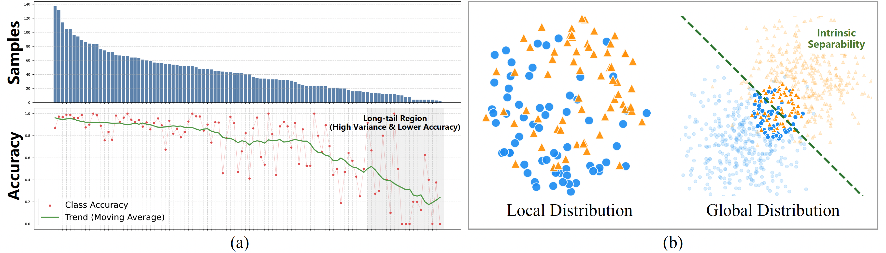

<h2>
<a href="https://whu-usi3dv.github.io/TreeCLS/" target="_blank">Expert Knowledge-Guided Decision Calibration for Accurate Fine-Grained Tree Species Classification</a>
</h2>

This is the official PyTorch implementation of the following publication:

> **Expert Knowledge-Guided Decision Calibration for Accurate Fine-Grained Tree Species Classification**<br/>
> [Chen Long](https://chenlongwhu.github.io/), Dian Chen, Ruifei Ding, [Zhe Chen](https://github.com/ChenZhe-Code), [Zhen Dong](https://dongzhenwhu.github.io/index.html), [Bisheng Yang](https://3s.whu.edu.cn/info/1025/1415.htm)<br/>
> *Under Review*<br/>
> Paper


## 🔭 Introduction
<p align="center" style="font-size:18px">
<strong>Expert Knowledge-Guided Decision Calibration for Accurate Fine-Grained Tree Species Classification</strong>
</p>


<p align="justify">
<strong>Abstract:</strong> Accurate fine-grained tree species classification is critical for forest inventory and biodiversity monitoring.
Existing methods predominantly focus on designing complex architectures to fit local data distributions. However, they often overlook the long-tailed distributions and high inter-class similarity inherent in limited data, thereby struggling to distinguish between few-shot or confusing categories.
In the process of knowledge dissemination in the human world, individuals will actively seek expert assistance to transcend the limitations of local thinking.
Inspired by this, we introduce an external "Domain Expert" and propose an Expert Knowledge-Guided Classification Decision Calibration Network (EKDC-Net) to overcome these challenges.
Our framework addresses two core issues: expert knowledge extraction and utilization.
Specifically, we first develop a Local Prior Guided Knowledge Extraction Module (LPKEM). By leveraging Class Activation Map (CAM) analysis, LPKEM guides the domain expert to focus exclusively on discriminative features essential for classification. Subsequently, to effectively integrate this knowledge, we design an Uncertainty-Guided Decision Calibration Module (UDCM). This module dynamically corrects the local model's decisions by considering both overall category uncertainty and instance-level prediction uncertainty.
Furthermore, we present a large-scale classification dataset covering 102 tree species, named CU-Tree102 to address the issue of scarce diversity in current benchmarks.
Experiments on three benchmark datasets demonstrate that our approach achieves state-of-the-art performance. Crucially, as a lightweight plug-and-play module, EKDC-Net improves backbone accuracy by **6.42% ** and precision by **11.46%** using only **0.08M** additional learnable parameters.
</p>

## 💻 Requirements
The code has been trained on:
- Ubuntu 22.04
- CUDA 11.8
- Python 3.9.18
- Pytorch 2.1.2
- GeForce RTX 4090 $\times$ 1.

## 🔧 Installation
- First, create the conda environment:
  ```
  conda env create -f environment.yaml
  conda activate treecls
  ```


## 💾 Datasets
We used two datasets for training and three datasets for evaluation.

#### CU-Tree102

We proposed CU-Tree102 dataset available at the [Google Drive](https://drive.google.com/file/d/1AdtGAmpjyJ9SlDD_6Qy0rS5QQU4y0Rn_/view?usp=sharing)

#### RSTree

We reprocessed [WHU-RSTree](https://github.com/WHU-USI3DV/WHU-STree) to obtain this classification dataset, available at [Google Drive](https://drive.google.com/file/d/1duPamPg6EyapORjU9hINru-Wef_70_pt/view?usp=sharing).

#### Jekyll

Jekyll Dataset is available at the [Jekyll Website](https://ytt917251944.github.io/dataset_jekyll/).


## 🚅 Pretrained model

You can download the pretrained model from [GoogleDrive](https://drive.google.com/file/d/1byTpnKF43wqVydoJnHMyayCVDMTFhuc7/view?usp=sharing), and put it in folder `records/`.

## ⏳ Train

To train EKDC-Net, you should prepare the dataset, and replace the ["val_root"](/configs/paths/default.yaml) to your data path. Then, you use the follow command:

```bash
$ python main.py --c config/whole_pipeline.yaml         # for CGL baseline
```

## ✏️ Test
To eval EKDC-Net on CU-Tree102 Dataset, you can use the following commands:
```bash
$ python eval.py --pr records/whole_pipeline
```

## 🔗 Related Projects
We sincerely thank the excellent projects:
- [HERBS](https://github.com/chou141253/FGVC-HERBS) for DataLoader and Baseline Model.
- [FreeReg](https://github.com/WHU-USI3DV/FreeReg) for readme template;
